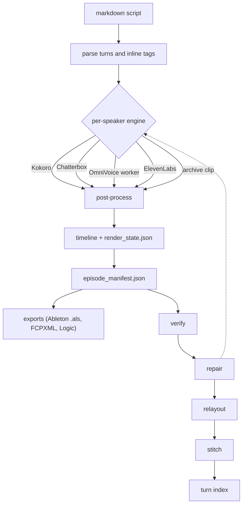

<div align="center">
  <picture>
    <source media="(prefers-color-scheme: dark)" srcset="assets/logo-dark.svg">
    <source media="(prefers-color-scheme: light)" srcset="assets/logo-light.svg">
    
  </picture>
  <p>Render markdown podcast scripts to per-turn speech, and export Ableton, FCPXML, and Logic sessions.</p>
  <p>
    <a href="https://github.com/th30d0re/scriptCast/releases"></a>
    <a href="LICENSE"></a>
    <a href="https://www.python.org/downloads/"></a>
    
    
  </p>
  <p>
    <a href="#quickstart">Quickstart</a> ·
    <a href="#how-it-works">How it works</a> ·
    <a href="#commands">Commands</a> ·
    <a href="#configuration">Configuration</a> ·
    <a href="#license">License</a>
  </p>
</div>

scriptCast renders a markdown podcast script into per-turn speech audio and exports the result as an Ableton Live set, a Final Cut Pro timeline, or a Logic Pro session. Each speaker turn is synthesized by the engine its voice configuration names — MLX Kokoro, MLX Chatterbox, ElevenLabs, or OmniVoice — post-processed onto a shared timeline, and verified against the script with on-device Whisper.

<table>
  <tr>
    <td>🗣️<br><b>Per-speaker engines</b><br>Kokoro, Chatterbox, OmniVoice, ElevenLabs</td>
    <td>🎞️<br><b>Archival clips</b><br>Spliced into the timeline</td>
    <td>🕵️<br><b>Whisper verification</b><br>With heteronym stress checks</td>
  </tr>
  <tr>
    <td>🔄<br><b>Automatic repair loop</b><br>For failed turns</td>
    <td>⏱️<br><b>Re-timing</b><br>Without re-synthesis</td>
    <td>🎛️<br><b>Exports</b><br>To Ableton Live, Final Cut Pro, and Logic Pro</td>
  </tr>
</table>

> [!IMPORTANT]
> scriptCast requires Apple Silicon. The MLX engines run on arm64 only, and the entry point checks the machine architecture and exits on anything else.

> [!NOTE]
> The name `scriptcast` on PyPI belongs to an unrelated project. Install from the GitHub tag, release wheel, or clone and install from source.

> [!WARNING]
> ElevenLabs renders spend your ElevenLabs account credits.

> [!TIP]
> The header timestamp is a source reference. Inter-turn spacing comes from the `--gap-ms` render flag, and a turn's identity (`turn_id`) is a hash of speaker and text, so re-timestamping a script re-synthesizes nothing.

## Quickstart

**1. Install**

```bash
# From the release tag, with the verification tools:
pip install "scriptcast[verify] @ git+https://github.com/th30d0re/scriptCast@v0.1.0"

# Or from a clone:
git clone https://github.com/th30d0re/scriptCast.git && cd scriptCast
pip install -e .
```

Optional extras (combine them as `[verify,elevenlabs]`):

```bash
pip install -e ".[verify]" # mlx-whisper, for scriptcast-verify and friends
pip install -e ".[elevenlabs]" # the ElevenLabs engine
```

The release page also carries a wheel and an sdist for `pip install scriptcast-0.1.0-py3-none-any.whl`.

ffmpeg handles archival clip decoding, reference extraction, and episode stitching, so install it too (`brew install ffmpeg`).

ElevenLabs renders read the API key from the `ELEVENLABS_API_KEY` environment variable.

OmniVoice pins torch 2.8 against this package's MLX stack, so it runs out of process in its own virtualenv:

```bash
python3 -m venv .venv-omnivoice
.venv-omnivoice/bin/pip install torch==2.8.0 torchaudio==2.8.0 omnivoice
```
The engine locates the interpreter through the `omnivoice_python` project key (default `.venv-omnivoice/bin/python`, relative to the project root). The worker starts with the project root as its working directory, so relative `reference_audio` paths in the voices file resolve against the project root.

**2. Create a project**

Create a project directory with a minimal `scriptcast.toml`, a `voices.yaml` for your speakers, and a `scripts/ep01.md` script.

```bash
cat << 'EOF' > scriptcast.toml
voices = "voices.yaml"
outputs = "outputs"
EOF

cat << 'EOF' > voices.yaml
speakers:
  host_name:              # the id of "Host Name": lowercased, spaces as underscores
    name: "Host Name"
    engine: "mlx_kokoro"
    kokoro_voice: "am_adam"
    lang_code: "a"
    speed: 1.0
EOF

mkdir -p scripts
cat << 'EOF' > scripts/ep01.md
Host Name (00:00)
Welcome to the first episode.

Host Name (00:05)
Let's get started.
EOF
```

**3. Render and Verify**

The full loop, from script to checked episode:

```bash
# 1. Render: parse, synthesize, post-process, lay out the timeline.
scriptcast --transcript scripts/ep01.md --episode-id ep01

# 2. Verify: transcribe every segment with on-device Whisper and score it
#    against the script. Heteronyms also get a phoneme stress check.
scriptcast-verify outputs/ep01 --transcript scripts/ep01.md

# 3. Repair: re-synthesize the turns that failed and re-check, until they
#    pass or hit --max-passes. The final pass relays the timeline.
scriptcast-repair outputs/ep01 --transcript scripts/ep01.md \
    --voices voices.yaml --episode-id ep01

# 4. Relayout: re-time the episode (uniform gaps, positions recomputed from
#    the audio on disk) without re-synthesizing anything.
scriptcast-relayout outputs/ep01 --gap-ms 350

# 5. Stitch: one MP3 matching the manifest timeline.
scriptcast-stitch outputs/ep01

# 6. Turn index: TURN_INDEX.csv, an editor's lookup table for the episode.
scriptcast-turn-index outputs/ep01 --transcript scripts/ep01.md
```

## How it works



## Commands

<details><summary>Useful render flags</summary>

`--dry-run` (parse and manifest only), `--overwrite`, `--gap-ms`, `--regenerate-turns 5,10-15`, `--precision-insert`, `--detect-changes`, `--fcpxml`, `--logic` / `--logic-dry-run`, `--skip-als`, `--ableton-project-als`, `--tail-ms`, `--speech-threshold`, `--no-trim`, `--max-turns`, `--sample-seconds`.

</details>

| Command | Purpose |
|---|---|
| `scriptcast` | Render a markdown script to per-turn speech and lay out the timeline and exports. |
| `scriptcast-verify` | Transcribe every rendered segment and compare it to the text it was given. |
| `scriptcast-repair` | Verify a rendered episode and re-synthesize whatever fails, until it passes. |
| `scriptcast-relayout` | Re-time a rendered episode without re-synthesizing any audio. |
| `scriptcast-stitch` | Stitch a rendered episode into one MP3 that matches the manifest timeline. |
| `scriptcast-retime` | Recompute an episode script's timestamps from the measured audio in the rendered manifest. |
| `scriptcast-turn-index` | Write TURN_INDEX.csv for a rendered episode. |
| `scriptcast-outliers` | Flag turns whose rendered audio does not match the text it was given. |
| `scriptcast-stress` | Check that rendered heteronyms were spoken in the reading the script needs (judge one heteronym in one WAV). |
| `scriptcast-clip` | Cut an archival excerpt by naming its first and last words. |
| `scriptcast-reference` | Turn a raw recording into a voice reference clip and its exact transcript. |
| `scriptcast-audition` | Score a candidate reference clip on how reliably it clones (render candidate references against a speaker). |
| `scriptcast-calibrate` | Find a spelling that makes the TTS engine say a heteronym the intended way. |

## Configuration

<details><summary>Project configuration details</summary>

A project is a directory containing a `scriptcast.toml`. The project root is `$SCRIPTCAST_PROJECT` when that environment variable is set, otherwise the nearest directory at or above the current working directory that contains a `scriptcast.toml`, otherwise the current working directory. Every key is optional; every relative path anchors at the project root. An unknown key raises an error that lists the known keys. See `examples/scriptcast.toml` for a fully commented configuration.

| key | default | what reads it |
|---|---|---|
| `voices` | `voices.yaml` | `scriptcast` (default for `--voices`), `scriptcast-calibrate` |
| `pronunciations` | `pronunciations.yaml` | pronunciation steering for heteronyms; written by `scriptcast-calibrate --write` |
| `speaker_rates` | `speaker_rates.json` | `scriptcast-retime`, `scriptcast-outliers` |
| `clips` | `archive/clips.yaml` | the archival clip registry (`scriptcast/archive.py`); written by `scriptcast-clip` |
| `clip_sources` | `archive/sources` | `scriptcast-clip` copies source recordings here |
| `references` | `voices/candidates` | `scriptcast-reference` writes reference WAVs and `reference_texts.json` here |
| `scripts` | `scripts` | `scriptcast-calibrate` mines real sentences here |
| `outputs` | `outputs` | `scriptcast` (default for `--out-dir`), `scriptcast-calibrate` |
| `omnivoice_python` | `.venv-omnivoice/bin/python` | the OmniVoice engine |

</details>

## Script format

<details><summary>Script layout and tags</summary>

A script is a markdown file of speaker turns. A turn is a header line followed by body lines:

```
Display Name (MM:SS)
Body text on the following lines.
```

The parser enforces these rules:
- The header is exactly `Display Name (MM:SS)`. Keep markdown bold off the header line; the header pattern anchors on the closing parenthesis at end of line, so a bolded header matches nothing.
- The speaker id is the display name lowercased with spaces as underscores (`Host Name` becomes `host_name`). Every speaker id in the script needs an entry in the voices file.
- Every body line is spoken. Stage directions and production cues get read aloud, so keep them out of the script.
- Text before the first header is skipped with a warning, so a title line at the top of the file is safe.
- Markdown emphasis (`*`, `**`, `_`, `__`) is stripped outside tags. Tag contents keep their characters.

Four tags are recognized inside a turn body:
- `[pause:800ms]` — silence of the given length in milliseconds.
- `[beat]` — a 400 ms pause.
- `[clip:id]` — plays the registered archival excerpt `id` in place of synthesis (see the clips registry below). The text after the tag is the excerpt's verbatim transcript; captions show it and verification checks the audio against it.
- `[emphasis]` and `[tone:...]` — annotations. They are logged and carried in the turn text; a turn marked `[emphasis]` renders from the speaker's expressive reference on engines that have one (OmniVoice).

Any other bracketed tag falls through and is spoken verbatim.

</details>

## Voices

<details><summary>Voice configuration</summary>

The voices file (`voices.yaml` by default, or `--voices`) maps speaker ids to engines under a top-level `speakers` mapping. The supported engines are `kokoro` (alias `mlx_kokoro`), `elevenlabs`, `mlx_chatterbox`, `omnivoice`, and `archive`. `name`, `character_profile`, and `speed` (default 1.0) apply to every engine.

```yaml
speakers:
  host:
    name: "Host"
    engine: "mlx_kokoro"
    kokoro_voice: "am_adam"       # required for kokoro/mlx_kokoro
    lang_code: "a"                # required for kokoro/mlx_kokoro
    speed: 1.0

  guest:
    name: "Guest"
    engine: "mlx_chatterbox"
    reference_audio: "voices/candidates/guest_reference.wav"  # required
    exaggeration: 0.0             # optional, default 0.0
    temperature: 0.6              # optional, default 0.6
    cfg_weight: 0.7               # optional, default 0.7

  narrator:
    name: "Narrator"
    engine: "elevenlabs"
    elevenlabs_voice_id: "XXXXXXXXXXXXXXXXXXXXXX"  # required
```

For OmniVoice, `reference_audio` and its word-for-word transcript `reference_text` are both required. The expressive pair (`reference_audio_expressive` / `reference_text_expressive`) is optional and must be declared together; a turn marked `[emphasis]` renders from it. `speed` scales the duration estimate OmniVoice derives from the reference clip. See `examples/voices.omnivoice.yaml`.

A speaker on the `archive` engine plays registered recordings and needs no voice fields; its turns must contain exactly one `[clip:id]` tag followed by the excerpt transcript.

</details>

## Clips registry

<details><summary>Archival clip integration</summary>

The clips registry (`archive/clips.yaml` by default) records where each archival excerpt comes from:

```yaml
clips:
  interview_excerpt:
    source: archive/sources/interview_excerpt.m4a
    start: 12.40          # seconds into the source
    end: 48.15
    citation: "Author, A. (Year). Title. Publication."
    origin_url: https://example.com/recording
    content_note: Optional editorial note.
```

`source`, `start`, and `end` are required; `citation`, `origin_url`, and `content_note` are optional metadata. The excerpt is decoded with ffmpeg, level-matched to the rendered voices, and given short edge fades.

`scriptcast-clip` cuts an excerpt by naming its first and last words — it transcribes the source with Whisper word timings, copies the source into the project's clip sources directory, writes the registry entry, and prints the script turn to paste:

```bash
scriptcast-clip ~/Downloads/interview.m4a --id interview_excerpt \
    --from "first words of the excerpt" --to "last words of it" \
    --citation "Author, A. (Year). Title." --url https://example.com/recording
```

</details>

## Output files

<details><summary>Files generated by a render</summary>

A render writes an episode directory under `outputs/` (or `--out-dir`):

- `episode_manifest.json` — the per-turn, per-segment timeline: speaker, source timestamp, start/end, speech duration, gaps, checksums. `swift/EpisodeManifest.swift` is the Swift decoding contract for this file, for Swift and iOS apps that read it.
- `render_state.json` — schema 2.0 render state: source hash, turn fingerprints, segment positions. `--detect-changes`, `--precision-insert`, `--regenerate-turns`, and the repair tooling re-read it to preserve unchanged audio and positions across renders.
- `Samples/Processed/<speaker_id>/<turn_id>_chunk_NNNN.wav` — the rendered audio, 48 kHz WAV.
- `<episode>.als` — an Ableton Live set. Beat positions are computed at a fixed 120 BPM, and the generator pins the set's tempo — manual value and tempo automation alike — to 120. The set template comes from `SCRIPTCAST_ALS_TEMPLATE` when set, otherwise the "Podcast & Radio" or default set templates inside `/Applications/Ableton Live*.app`. `--ableton-project-als` copies the generated set into a Live project.
- `<episode>.fcpxml` — a Final Cut Pro timeline, with `--fcpxml`.
- Logic Pro: `--logic` builds the session in a running Logic Pro via AppleScript; `--logic-dry-run` writes `<episode>_logic_export.applescript` instead.
- `<episode>.mp3` — written by `scriptcast-stitch`.
- `TURN_INDEX.csv` — written by `scriptcast-turn-index`.

> [!NOTE]
> Ableton caches each sample's waveform in a sibling `.asd` file. A re-rendered turn keeps its filename while its audio changes, and a stale cache makes Live draw the previous render's waveform. `scriptcast-relayout` deletes every `.asd` under the episode directory so Live re-analyses on open.

</details>

## Contributing

```bash
git clone https://github.com/th30d0re/scriptCast.git
cd scriptCast
pip install -e ".[verify,elevenlabs]"
pip install pytest
python -m pytest tests
```

## License

scriptCast is licensed under [GPL-3.0-or-later](LICENSE). Redistributed modifications must carry the same open-source license.
